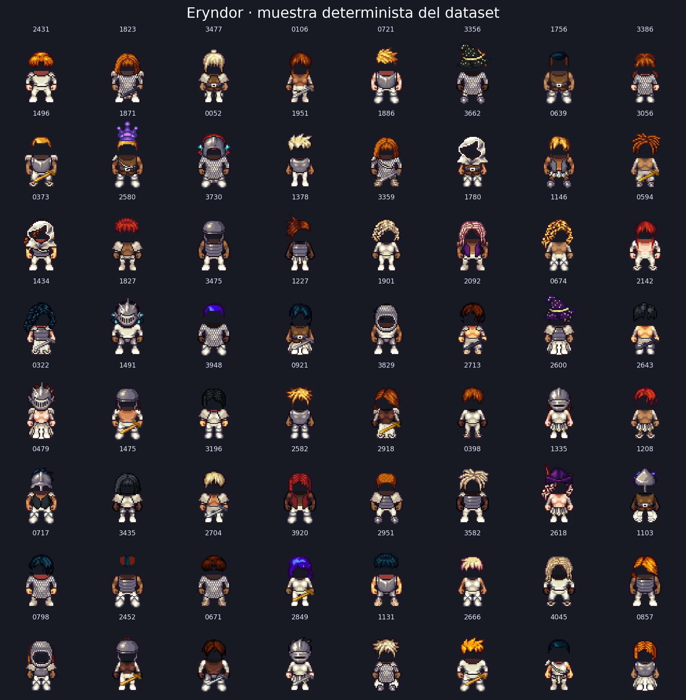

# Eryndor: Guardianes del Velo

Proyecto 2 de Deep Learning 2026: diseño generativo de personajes para un RPG pixel art de aventura y magia mediante una GAN entrenada por el equipo.

> **Estado actual:** fase 2 completada. El dataset está construido y auditado; la GAN todavía no se ha entrenado y no existe una galería final.

## Resultado de esta fase

| Evidencia | Resultado real |
|---|---:|
| Imágenes RGB | 4,096 |
| Resolución | 64 × 64 |
| Hashes duplicados | 0 |
| Archivos faltantes | 0 |
| Tipos corporales | 2,060 male / 2,036 female |
| Estilos de cabello | 44 |
| Estilos de torso | 18 |
| Ocupación media | 23.18% |
| Capas LPC acreditadas | 254 / 254 |
| Lote validado | `[64, 3, 64, 64]`, `float32`, `[-1, 1]` |

El conjunto usa una pose frontal consistente, fondo obsidiana y combinaciones de armadura, ropa, cabello, sombreros, tonos y armas acordes con el universo. La construcción usa semilla `2026`, deduplicación SHA-256 y manifiesto por imagen.



## Universo visual

Eryndor es un mundo de fantasía fracturado por magia mineral. Sus guardianes exploran ruinas, recuperan reliquias y contienen grietas arcanas. El lenguaje visual combina sprites detallados, siluetas completas, materiales gastados y acentos de cian, oro y amatista.

La dirección creativa completa está en [`BRIEF.md`](BRIEF.md) y el sistema visual en [`docs/THEME.md`](docs/THEME.md).

## Datos y licencias

Las composiciones derivan de recursos abiertos del proyecto Liberated Pixel Cup:

- [Universal LPC Spritesheet Character Generator](https://github.com/LiberatedPixelCup/Universal-LPC-Spritesheet-Character-Generator)
- [LPC Style Guide](https://lpc.opengameart.org/static/LPC-Style-Guide/build/styleguide.html)
- [LPC Base Assets](https://opengameart.org/content/liberated-pixel-cup-lpc-base-assets-sprites-map-tiles)

Se usó el commit `4963a69795255fb15a934c47f478a8bdcf3668f5`. El pipeline vinculó las 254 capas empleadas con sus créditos; no quedó ninguna sin resolver. Consulte [`docs/LPC_ATTRIBUTION.md`](docs/LPC_ATTRIBUTION.md) y [`docs/LPC_CREDITS_USED.csv`](docs/LPC_CREDITS_USED.csv).

LPC mezcla licencias como CC0, CC-BY, CC-BY-SA, OGA-BY y GPL. Este proyecto conserva autores, licencias y URLs, y no presenta el material base como propietario.

## Reproducir la fase 2

Desde la raíz del repositorio:

```powershell
python -m venv .venv
.\.venv\Scripts\Activate.ps1
pip install -r requirements.txt
powershell -ExecutionPolicy Bypass -File scripts\fetch_lpc.ps1
python scripts\prepare_dataset.py --count 4096
jupyter lab notebooks\01_proyecto_gan.ipynb
```

Si el manifiesto ya existe, el script lo reutiliza. Para regenerar exactamente las composiciones con la misma semilla:

```powershell
python scripts\prepare_dataset.py --count 4096 --overwrite
```

Salidas principales:

- `data/processed/sprites/`: PNG preparados;
- `data/processed/manifest.csv`: metadatos, SHA-256 y capas fuente;
- `artifacts/dataset/`: hoja de contacto y distribuciones;
- `artifacts/metrics/dataset_summary.json`: resumen verificable;
- `artifacts/metrics/dataloader_smoke_test.json`: contrato tensorial;
- `docs/LPC_CREDITS_USED.csv`: atribución por capa.

## Experimentos pre-registrados

| ID | Pérdida | Estabilización | Variable modificada |
|---|---|---|---|
| A | BCE no saturante | Baseline | Ninguna |
| B | Hinge loss | Igual al baseline | Solo la pérdida |
| C | BCE no saturante | Normalización espectral en D | Solo la estabilización |

Los tres experimentos usarán los mismos datos, arquitectura, semilla, ruido fijo, optimizadores y 60 épocas. El diseño completo está en [`docs/PLAN_EXPERIMENTAL.md`](docs/PLAN_EXPERIMENTAL.md).

## Próxima fase

1. Implementar generador, discriminador y pérdidas.
2. Verificar formas, gradientes, guardado y reanudación.
3. Ejecutar un smoke test corto del baseline.
4. Entrenar A, B y C con el protocolo controlado.
5. Comparar evolución fija, curvas, diversidad y vecinos cercanos.
6. Generar 200 candidatos y seleccionar 10, declarando `10/200 = 5%`.

## Estructura

```text
.
├── artifacts/               # Figuras y métricas
├── checkpoints/             # Pesos y estados de optimizador
├── configs/experiments.yaml
├── data/raw/                # Clon LPC selectivo, no versionado
├── data/processed/          # Dataset generado, no versionado
├── docs/                    # Plan, tema y atribuciones
├── galeria/                 # Diez salidas finales de la GAN
├── notebooks/01_proyecto_gan.ipynb
├── scripts/fetch_lpc.ps1
├── scripts/prepare_dataset.py
├── src/data.py
├── BRIEF.md
└── requirements.txt
```

## Transparencia sobre IA

Se utilizó un asistente de IA para estructurar el repositorio, proponer y revisar código, apoyar la dirección creativa y documentar la metodología. Los integrantes deben verificar las ejecuciones, interpretar los resultados y defender las decisiones. Ninguna imagen de un generador externo se incorporó al dataset ni podrá presentarse como salida final de la GAN.

La auditoría siguió procedimientos estructurados de análisis reproducible descritos por Kassis et al. (2026), *Scientific Agent Skills: A Library of Procedural Knowledge for Research Agents*, [arXiv:2609.00065](https://arxiv.org/abs/2609.00065).
