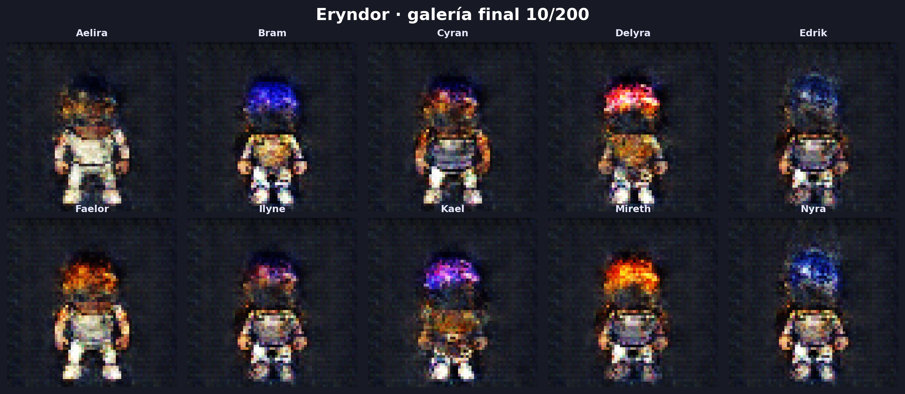
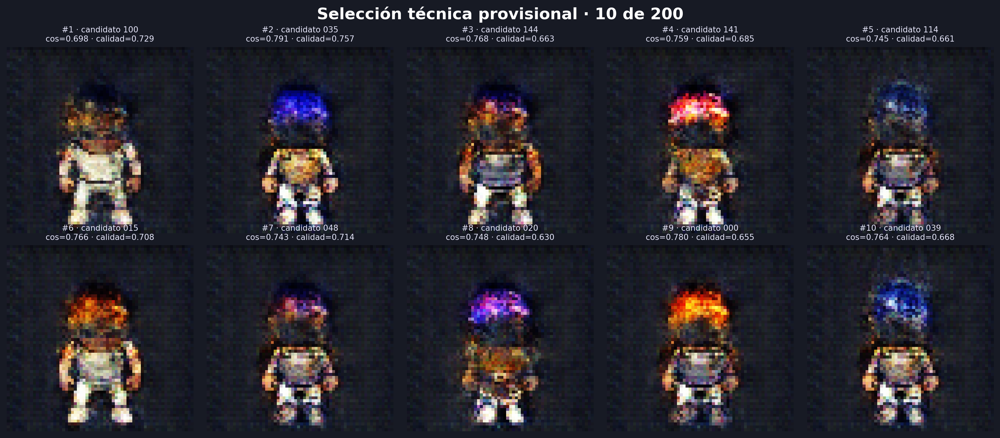

<div align="center">

# ✦ Eryndor: Guardianes del Velo ✦

### Diseño generativo de personajes para un RPG pixel art de aventura y magia

<p>
  
  
  
  
</p>



**Pablo Daniel Barillas Moreno · Wilson Alejandro Calderón**  
Universidad del Valle de Guatemala · Deep Learning 2026 · Sección 30

</div>

> [!IMPORTANT]
> **Entrega final validada.** Las fases 1–15 están cerradas con el checkpoint de `bce_spectral_norm` en época 60. Los diez PNG, vectores `z`, manifiesto, procedencia y regeneración exacta se verifican desde los mismos artefactos usados por el notebook, la presentación y el informe.

<div align="center">

[Resultados](#resultados) · [Universo](#universo) · [Experimentos](#experimentos) · [Galería](#galeria) · [Reproducibilidad](#reproducibilidad) · [Presentación](#presentacion)

</div>

| Entregable | Acceso directo |
|---|---|
| Notebook final ejecutado | [`notebooks/01_proyecto_gan.ipynb`](notebooks/01_proyecto_gan.ipynb) |
| Entrenamiento para Colab | [`notebooks/02_entrenamiento_colab.ipynb`](notebooks/02_entrenamiento_colab.ipynb) |
| Presentación interactiva | [`presentation/presentacion.html`](presentation/presentacion.html) |
| Presentación entregable | [`presentation/presentacion.pdf`](presentation/presentacion.pdf) |
| Informe final | [`report/informe_final_eryndor.pdf`](report/informe_final_eryndor.pdf) · [fuente `.tex`](report/informe_final_eryndor.tex) |
| Auditoría integral | [`artifacts/delivery/validation.json`](artifacts/delivery/validation.json) |

---

<a id="resultados"></a>
## ✧ Resultados finales

| Evidencia | Resultado real |
|---|---:|
| Imágenes RGB | 4,096 |
| Resolución | 64 × 64 |
| Hashes duplicados | 0 |
| Archivos faltantes | 0 |
| Tipos corporales | 2,060 male / 2,036 female |
| Estilos de cabello | 44 |
| Estilos de torso | 18 |
| Ocupación media | 23.18% |
| Capas LPC acreditadas | 254 / 254 |
| Lote validado | `[64, 3, 64, 64]`, `float32`, `[-1, 1]` |
| Parámetros G / D | 3,806,080 / 2,765,568 |
| Smoke test | 8 pasos, 64 imágenes, aprobado |
| Checkpoint recargado | Error máximo absoluto 0 |
| Entrenamiento A / B / C | 60 / 60 / 60 épocas |
| Auditoría de fase 8 | 180 épocas + 11,520 pasos válidos |
| Modelo final | C · BCE + spectral normalization |
| Pipeline de vecinos | Implementado: ResNet18 + coseno + MSE |
| Checkpoint C local | Archivo verificado, época interna 60/60 |
| Pesos ResNet18 | Oficiales y disponibles en caché local |
| Smoke test de fase 10 | 200 candidatos → 10, determinista, 5% |
| Vecinos de fase 9 | Coseno medio 0.7660; MSE medio 0.02615 |
| Control de memorización | 0 duplicados exactos; 0 banderas de revisión |
| Selección GAN 10/200 | 200 generados; 97 elegibles; 10 seleccionados |
| Vecino medio de los seleccionados | Coseno 0.7563; MSE 0.02152 |
| Galería final válida | 10 PNG únicos; selección 10/200 coincidente; diferencia RGB 0 |
| Presentación PDF | 12 páginas, validación automática aprobada |
| Presentación HTML | 12 escenas, teclado, vista general y validación en navegador |
| Entrenamiento Colab | Completado; artefactos sincronizados |

El conjunto usa una pose frontal consistente, fondo obsidiana y combinaciones de armadura, ropa, cabello, sombreros, tonos y armas acordes con el universo. La construcción usa semilla `2026`, deduplicación SHA-256 y manifiesto por imagen.


<a id="universo"></a>
## ✦ Universo visual

Eryndor es un mundo de fantasía fracturado por magia mineral. Sus guardianes exploran ruinas, recuperan reliquias y contienen grietas arcanas. El lenguaje visual combina sprites detallados, siluetas completas, materiales gastados y acentos de cian, oro y amatista.

La dirección creativa completa está en [`BRIEF.md`](BRIEF.md) y el sistema visual en [`docs/THEME.md`](docs/THEME.md).

## ◈ Datos y licencias

Las composiciones derivan de recursos abiertos del proyecto Liberated Pixel Cup:

- [Universal LPC Spritesheet Character Generator](https://github.com/LiberatedPixelCup/Universal-LPC-Spritesheet-Character-Generator)
- [LPC Style Guide](https://lpc.opengameart.org/static/LPC-Style-Guide/build/styleguide.html)
- [LPC Base Assets](https://opengameart.org/content/liberated-pixel-cup-lpc-base-assets-sprites-map-tiles)

Se usó el commit `4963a69795255fb15a934c47f478a8bdcf3668f5`. El pipeline vinculó las 254 capas empleadas con sus créditos; no quedó ninguna sin resolver. Consulte [`docs/LPC_ATTRIBUTION.md`](docs/LPC_ATTRIBUTION.md) y [`docs/LPC_CREDITS_USED.csv`](docs/LPC_CREDITS_USED.csv).

LPC mezcla licencias como CC0, CC-BY, CC-BY-SA, OGA-BY y GPL. Este proyecto conserva autores, licencias y URLs, y no presenta el material base como propietario.

## ⟡ Preparación del dataset

Desde la raíz del repositorio:

```powershell
python -m venv .venv
.\.venv\Scripts\Activate.ps1
pip install -r requirements.txt
powershell -ExecutionPolicy Bypass -File scripts\fetch_lpc.ps1
python scripts\prepare_dataset.py --count 4096
jupyter lab notebooks\01_proyecto_gan.ipynb
```

En Linux o Google Colab, el equivalente multiplataforma es:

```bash
python scripts/fetch_lpc.py
```

Si el manifiesto ya existe, el script lo reutiliza. Para regenerar exactamente las composiciones con la misma semilla:

```powershell
python scripts\prepare_dataset.py --count 4096 --overwrite
```

Salidas principales:

- `data/processed/sprites/`: PNG preparados;
- `data/processed/manifest.csv`: metadatos, SHA-256 y capas fuente;
- `artifacts/dataset/`: hoja de contacto y distribuciones;
- `artifacts/metrics/dataset_summary.json`: resumen verificable;
- `artifacts/metrics/dataloader_smoke_test.json`: contrato tensorial;
- `docs/LPC_CREDITS_USED.csv`: atribución por capa.

## ⚗ Experimentos pre-registrados

| ID | Pérdida | Estabilización | Variable modificada |
|---|---|---|---|
| A | BCE no saturante | Baseline | Ninguna |
| B | Hinge loss | Igual al baseline | Solo la pérdida |
| C | BCE no saturante | Normalización espectral en D | Solo la estabilización |

Los tres experimentos usaron los mismos datos, arquitectura, semilla, ruido fijo, optimizadores y 60 épocas. El diseño completo está en [`docs/PLAN_EXPERIMENTAL.md`](docs/PLAN_EXPERIMENTAL.md).

## ⚙ Implementación y smoke test

La fase 3 incorporó:

- generador DCGAN de cinco convoluciones transpuestas;
- discriminador de cinco convoluciones con salida en logits;
- BCE no saturante y hinge loss bajo una interfaz común;
- normalización espectral opcional solo en D;
- entrenamiento adversarial con métricas por paso;
- rejillas de ruido fijo y curvas exportadas con Matplotlib;
- checkpoints atómicos con modelos, optimizadores, ruido fijo, estados aleatorios y estado de barajado del `DataLoader`;
- validación de guardado/recarga con salida idéntica.

Se eligió DCGAN porque el corpus es homogéneo, trabaja a resolución fija de 64 × 64, cabe en los recursos de Colab y permite aislar la pérdida y la estabilización sin cambiar simultáneamente la arquitectura. Es una decisión de control y trazabilidad experimental, no una afirmación de estado del arte.

Para repetir el diagnóstico:

```powershell
python scripts\smoke_test_gan.py
```

El smoke test real utilizó CPU, batch 8 y ocho pasos. Todas las pérdidas fueron finitas y las tres variantes respetaron las formas esperadas. El baseline mostró dominio temprano de D (`loss_D: 1.879 → 0.153`; `loss_G: 4.970 → 7.522`), una señal que deberá monitorearse durante las primeras épocas. Es un control de integración, no una comparación de calidad.


<a id="experimentos"></a>
## ◇ Entrenamiento controlado — puntos 6 a 8 del plan

Los tres experimentos completaron el protocolo pre-registrado: 4,096 imágenes, batch 64, 64 pasos por época, arquitectura idéntica, semilla de modelo `42` y el mismo ruido fijo con semilla `777`. Solo cambiaron la pérdida o la normalización espectral según el diseño A/B/C.

| Experimento | Épocas | loss D | loss G | Logit real | Logit falso para G | Diversidad fija |
|---|---:|---:|---:|---:|---:|---:|
| `baseline_bce` | 60 / 60 | 0.0789 | 5.6369 | 5.1900 | −5.6287 | 0.2585 |
| `hinge_loss` | 60 / 60 | 0.0000 | 8.1271 | 5.0046 | −8.1271 | 0.0136 |
| `bce_spectral_norm` | 60 / 60 | 0.1905 | 7.0557 | 5.4518 | −7.0458 | 0.2659 |

Las magnitudes BCE y hinge no se comparan directamente. La decisión usa la trayectoria completa, el mismo ruido fijo y revisión visual: el baseline conserva personajes reconocibles y diversidad final de 0.2585; hinge colapsa a una plantilla casi única, termina en 0.0136 y acumula 23 épocas con `loss_D < 1e-3`; la variante con normalización espectral mantiene la mayor diversidad final (0.2659) y media de las últimas diez épocas (0.2671), además de la mejor variedad cromática observada.

Por estas señales, y después de confirmar el resultado con vecinos ResNet18, MSE, la selección 10/200 y la regeneración exacta, **C · BCE + spectral normalization** es el modelo final. La selección no se basó en comparar directamente escalas incompatibles de pérdida.


La auditoría reproducible se ejecuta con:

```powershell
python scripts\analyze_phase8.py
```

El ejecutor secuencial reanuda automáticamente cada experimento desde `checkpoints/<id>/latest.pt`:

```powershell
python scripts\train_all.py --epochs 60 --device auto
```

También se puede ejecutar cada variante por separado:

```powershell
python scripts\train_experiment.py --experiment baseline_bce --epochs 60
python scripts\train_experiment.py --experiment hinge_loss --epochs 60
python scripts\train_experiment.py --experiment bce_spectral_norm --epochs 60
python scripts\compare_experiments.py
```

El checkpoint completo se mantiene como archivo rodante para limitar el uso de disco; en las épocas 5, 10, 15, ..., 60 se conserva además una instantánea liviana del generador y su rejilla fija.

## ⌁ Fase 9: vecinos más cercanos

[`scripts/analyze_phase9_neighbors.py`](scripts/analyze_phase9_neighbors.py) genera las 16 muestras del ruido fijo del checkpoint C y compara cada una contra las 4,096 imágenes de entrenamiento. Usa ResNet18 IMAGENET1K_V1 sin su capa final, embeddings normalizados y similitud coseno; el MSE en píxeles funciona como comprobación secundaria.

La fase queda separada de la selección final: no genera los 200 candidatos ni escribe en `galeria/`. Produce `fixed_noise_neighbors.csv`, una figura lado a lado y un resumen JSON en `artifacts/phase9/`. Una regla declarada (`coseno ≥ 0.95` y `MSE ≤ 0.01`) solo marca casos para revisión y no se interpreta automáticamente como prueba de memorización.

La ejecución final verificó:

- dataset completo: 4,096 imágenes, cero faltantes y cero hashes duplicados;
- pesos oficiales de ResNet18 disponibles;
- checkpoint C en época interna 60/60 y SHA-256 `b032a9fa92e719b0500e54a7ee14d5c1a691386bb32459d38807305b699b7f80`;
- 16 muestras de ruido fijo con coseno medio `0.7660` y MSE medio `0.02615`;
- cero duplicados exactos y cero casos que cumplan simultáneamente `coseno ≥ 0.95` y `MSE ≤ 0.01`.

La auditoría se reproduce con:

```powershell
python scripts\check_phase9_readiness.py
python scripts\analyze_phase9_neighbors.py --device auto
```

El notebook de Colab también incluye estas celdas y respalda `artifacts/phase9/` en Drive.

## ✣ Fase 10: selección transparente 10/200

[`scripts/run_phase10_selection.py`](scripts/run_phase10_selection.py) implementa la selección técnica previa a la persistencia de la galería y los vectores `z` de la fase 11:

1. exige que la fase 9 haya aprobado con el mismo hash de checkpoint;
2. genera exactamente 200 candidatos con semilla `20261011`;
3. deriva límites de ocupación y contraste desde el dataset real;
4. calcula calidad técnica, vecino ResNet18, coseno, MSE y novedad para cada candidato;
5. elige el primero con `70% novedad + 30% calidad`;
6. elige los restantes con `55% diversidad interna + 30% novedad + 15% calidad`;
7. guarda las 200 métricas, los 10 índices ordenados y tres figuras de auditoría en `artifacts/phase10/`.

No existe reemplazo manual ni selección oculta. La ejecución real generó 200 candidatos, encontró 97 elegibles y seleccionó los índices `100, 35, 144, 141, 114, 15, 48, 20, 0, 39`. La tasa es `10/200 = 5%`, el coseno medio frente al vecino real es `0.7563`, el MSE medio es `0.02152` y no hay duplicados exactos:

```powershell
python scripts\smoke_test_phase10.py
python scripts\check_phase10_readiness.py
python scripts\run_phase10_selection.py --device auto
```

Las métricas completas están en `artifacts/phase10/candidate_metrics.csv`; la selección ordenada está en `selected_candidates.csv` y las figuras de auditoría incluyen la vista de los 200, la rejilla de los 10 y sus distribuciones.



<a id="galeria"></a>
## ✦ Galería y prueba de novedad — puntos 10 y 11 del plan

La implementación final cumple el protocolo obligatorio:

- exige un checkpoint de al menos 60 épocas antes de escribir `galeria/`;
- genera exactamente 200 candidatos con semilla `20261011` y conserva sus vectores `z`;
- deriva filtros de ocupación y contraste desde las 4,096 imágenes reales;
- usa ResNet18 preentrenada para vecinos por similitud coseno y reporta MSE en píxeles;
- selecciona 10 candidatos mediante novedad, calidad técnica y diversidad greedy;
- declara `10/200 = 5%` en el manifiesto y en la procedencia;
- guarda nombres y roles coherentes con Eryndor como trabajo creativo adicional;
- regenera los diez PNG desde el checkpoint y exige diferencia RGB máxima igual a cero.

Auditoría actual:

```powershell
python scripts\check_phase5_readiness.py
python scripts\smoke_test_evaluation.py
```

La galería final se reconstruye y valida con:

```powershell
python scripts\build_gallery.py --experiment bce_spectral_norm
python scripts\validate_gallery.py
```

Los pesos oficiales de ResNet18 ya están en la caché de este equipo. En un runtime nuevo de Colab se descargarán una vez; el programa nunca los sustituye silenciosamente por una red aleatoria.

> **Resultado actual honesto:** la galería de fase 11 fue regenerada desde el checkpoint y sus vectores `z`; los diez hashes son únicos, la selección coincide con fase 10 y la diferencia RGB máxima es cero.

| # | Personaje | Rol | Candidato | Coseno vecino | MSE |
|---:|---|---|---:|---:|---:|
| 1 | Aelira | Oráculo del Velo | 100 | 0.6981 | 0.01489 |
| 2 | Bram | Guardián rúnico | 35 | 0.7911 | 0.01485 |
| 3 | Cyran | Arcanista de ceniza | 144 | 0.7676 | 0.03245 |
| 4 | Delyra | Exploradora del musgo | 141 | 0.7593 | 0.02025 |
| 5 | Edrik | Alquimista solar | 114 | 0.7449 | 0.02029 |
| 6 | Faelor | Centinela de amatista | 15 | 0.7660 | 0.03430 |
| 7 | Ilyne | Tejedora de grietas | 48 | 0.7426 | 0.01655 |
| 8 | Kael | Custodio de la brasa | 20 | 0.7482 | 0.01530 |
| 9 | Mireth | Cartógrafa astral | 0 | 0.7804 | 0.02499 |
| 10 | Nyra | Vigía del abismo | 39 | 0.7644 | 0.02135 |

**Reflexión final.** Bram es el personaje más difícil de defender como nuevo porque alcanza el mayor coseno frente a una imagen real (`0.7911`). Comparte la silueta global, la pose y parte de la gramática cromática del vecino, aunque la composición generada no es una copia exacta (`MSE 0.01485`). Esto indica que la GAN aprendió bien la gramática frontal y restringida de LPC y recombinó atributos superficiales, pero su diversidad estructural sigue limitada por una única pose y bases anatómicas compartidas.

<a id="presentacion"></a>
## ◫ Presentación regenerable — punto 14 del plan

[`presentation/presentacion.html`](presentation/presentacion.html) es la versión interactiva para exponer: navegación por teclado, pantalla completa, vista general, diseño responsivo y actualización desde artefactos reales. [`presentation/presentacion.pdf`](presentation/presentacion.pdf) funciona como informe entregable y respeta el máximo de 12 diapositivas. Ambas incorporan la matriz exigida y cubren universo, datos, arquitectura, hipótesis A/B/C, ruido fijo, curvas, fallos, galería, vecinos, conclusiones y reflexión.

La presentación no contiene métricas escritas a mano: [`scripts/build_presentation.py`](scripts/build_presentation.py) lee los artefactos vigentes, genera `presentation/generated_results.tex`, compila con XeLaTeX y comprueba el número de páginas, el formato 16:9 y la presencia de texto. La versión HTML refleja las auditorías de fases 8–11 y muestra la galería definitiva, sus vecinos y la reflexión final.

La versión web se actualiza y valida con:

```powershell
python scripts\build_html_presentation.py
start presentation\presentacion.html
```

Para regenerarla:

```powershell
python scripts\build_presentation.py
```

Los resultados de validación quedan en `artifacts/presentation/build_status.json` y `html_status.json`. La tipografía GNU FreeSans se incluye con su licencia para que la apariencia sea reproducible.

## ☁ Entrenamiento reanudable en Colab

[`notebooks/02_entrenamiento_colab.ipynb`](notebooks/02_entrenamiento_colab.ipynb) guía la ejecución GPU sin cambiar el protocolo A/B/C. Reconstruye el dataset en el disco rápido del runtime, restaura avances desde Drive y usa `--backup-root` para reflejar checkpoints, métricas y ruido fijo al terminar cada época.

Cambios de seguridad para sesiones interrumpibles:

- `latest.pt` se sobrescribe atómicamente al finalizar **cada época**;
- las instantáneas históricas del generador y del ruido fijo permanecen cada cinco épocas;
- una nueva sesión puede restaurar automáticamente el estado respaldado;
- el notebook exige CUDA y verifica que no existan épocas duplicadas después de reanudar;
- el descargador `scripts/fetch_lpc.py` funciona en Linux, Windows y Colab.

Las fases 7–11 ya terminaron. Los artefactos de métricas, muestras, vecinos, selección y galería quedaron generados con el checkpoint C final de época 60. Los experimentos A y B se conservan como métricas, curvas y rejillas comparativas; el único peso oficial distribuido es C, el modelo seleccionado. GitHub ignora los checkpoints pesados por diseño, por lo que ese archivo se publica como activo de una versión de GitHub.

<a id="reproducibilidad"></a>
## ↻ Reproducibilidad final

Semillas y entorno usados:

| Componente | Valor |
|---|---|
| Dataset | `2026` |
| Inicialización y entrenamiento | `42` |
| Ruido fijo | `777` |
| Lote de 200 candidatos | `20261011` |
| Python local verificado | `3.13.1` |
| PyTorch / torchvision | `2.13.0+cpu` / `0.28.0+cpu` |
| NumPy / pandas | `2.2.2` / `2.2.3` |
| Matplotlib / Pillow | `3.10.1` / `11.1.0` |
| scikit-learn / nbformat | `1.8.0` / `5.10.4` |

La tabla documenta el entorno exacto con el que se regeneró y auditó la entrega final. En Colab, `requirements.txt` fija los rangos compatibles usados por el proyecto; el notebook comprueba CUDA y las dependencias al iniciar.

El archivo oficial es `checkpoints/bce_spectral_norm/latest.pt`, pesa aproximadamente 79 MB, corresponde internamente a la época 60 y tiene SHA-256 `b032a9fa92e719b0500e54a7ee14d5c1a691386bb32459d38807305b699b7f80`.

**Descarga pública:** [checkpoint final de Eryndor — GitHub Release v1.0.0](https://github.com/DanielBarillasM/Proyecto-2_Grupo-1_DLYSI_Sec-30/releases/download/v1.0.0/latest.pt).

Tras descargarlo, debe ubicarse en `checkpoints/bce_spectral_norm/latest.pt`. Su hash se valida con `python scripts/validate_delivery.py`; así, la galería puede regenerarse desde los pesos, `galeria/latents.npz` y el manifiesto versionado.

Validación integral desde la raíz:

```powershell
python scripts\build_notebook.py
python scripts\build_colab_notebook.py
python scripts\build_html_presentation.py
python scripts\build_presentation.py
python scripts\validate_delivery.py
```

La matriz está en [`docs/MATRIZ_EVIDENCIAS.md`](docs/MATRIZ_EVIDENCIAS.md) y el último dictamen automatizado en `artifacts/delivery/validation.json`.

## ⌘ Estructura del repositorio

```text
.
├── artifacts/               # Figuras y métricas, incluidas phase8/ y phase9/
├── checkpoints/             # Pesos y estados de optimizador
├── configs/experiments.yaml
├── data/raw/                # Clon LPC selectivo, no versionado
├── data/processed/          # Dataset generado, no versionado
├── docs/                    # Plan, tema, atribuciones y matriz de evidencias
├── galeria/                 # Diez salidas finales de la GAN
├── notebooks/01_proyecto_gan.ipynb
├── notebooks/02_entrenamiento_colab.ipynb
├── presentation/            # Fuente LaTeX, tipografía y PDF de 12 diapositivas
├── report/                  # Informe final en LaTeX
├── scripts/fetch_lpc.ps1
├── scripts/fetch_lpc.py
├── scripts/prepare_dataset.py
├── scripts/smoke_test_gan.py
├── scripts/train_experiment.py
├── scripts/train_all.py
├── scripts/compare_experiments.py
├── scripts/analyze_phase8.py
├── scripts/check_phase9_readiness.py
├── scripts/analyze_phase9_neighbors.py
├── scripts/check_phase10_readiness.py
├── scripts/run_phase10_selection.py
├── scripts/smoke_test_phase10.py
├── scripts/check_phase5_readiness.py
├── scripts/smoke_test_evaluation.py
├── scripts/build_gallery.py
├── scripts/build_presentation.py
├── scripts/build_html_presentation.py
├── scripts/build_colab_notebook.py
├── scripts/validate_gallery.py
├── scripts/validate_delivery.py
├── src/data.py
├── src/evaluation.py
├── src/losses.py
├── src/models.py
├── src/training.py
├── BRIEF.md
└── requirements.txt
```

## ◎ Transparencia sobre IA

Se utilizó un asistente de IA para estructurar el repositorio, proponer y revisar código, apoyar la dirección creativa y documentar la metodología. Los integrantes deben verificar las ejecuciones, interpretar los resultados y defender las decisiones. Ninguna imagen de un generador externo se incorporó al dataset ni podrá presentarse como salida final de la GAN.

La auditoría siguió procedimientos estructurados de análisis reproducible descritos por Kassis et al. (2026), *Scientific Agent Skills: A Library of Procedural Knowledge for Research Agents*, [arXiv:2609.00065](https://arxiv.org/abs/2609.00065).
