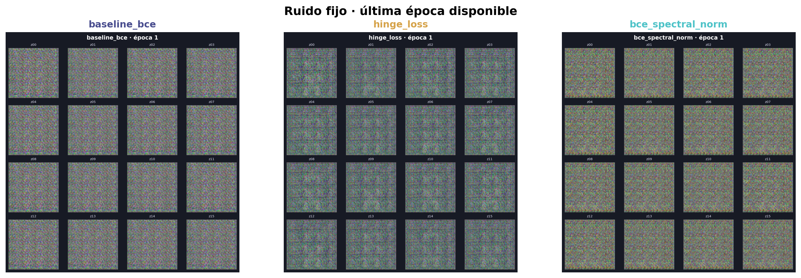

# Eryndor: Guardianes del Velo

Proyecto 2 de Deep Learning 2026: diseño generativo de personajes para un RPG pixel art de aventura y magia mediante una GAN entrenada por el equipo.

> **Estado actual:** fase 4 iniciada de forma reproducible. Los tres experimentos completaron 1 de 60 épocas, guardaron métricas, ruido fijo y checkpoints reanudables. La comparación y la galería siguen siendo provisionales hasta completar las 60 épocas.

## Resultado de esta fase

| Evidencia | Resultado real |
|---|---:|
| Imágenes RGB | 4,096 |
| Resolución | 64 × 64 |
| Hashes duplicados | 0 |
| Archivos faltantes | 0 |
| Tipos corporales | 2,060 male / 2,036 female |
| Estilos de cabello | 44 |
| Estilos de torso | 18 |
| Ocupación media | 23.18% |
| Capas LPC acreditadas | 254 / 254 |
| Lote validado | `[64, 3, 64, 64]`, `float32`, `[-1, 1]` |
| Parámetros G / D | 3,806,080 / 2,765,568 |
| Smoke test | 8 pasos, 64 imágenes, aprobado |
| Checkpoint recargado | Error máximo absoluto 0 |
| Entrenamiento A / B / C | 1 / 1 / 1 épocas de 60 |

El conjunto usa una pose frontal consistente, fondo obsidiana y combinaciones de armadura, ropa, cabello, sombreros, tonos y armas acordes con el universo. La construcción usa semilla `2026`, deduplicación SHA-256 y manifiesto por imagen.


## Universo visual

Eryndor es un mundo de fantasía fracturado por magia mineral. Sus guardianes exploran ruinas, recuperan reliquias y contienen grietas arcanas. El lenguaje visual combina sprites detallados, siluetas completas, materiales gastados y acentos de cian, oro y amatista.

La dirección creativa completa está en [`BRIEF.md`](BRIEF.md) y el sistema visual en [`docs/THEME.md`](docs/THEME.md).

## Datos y licencias

Las composiciones derivan de recursos abiertos del proyecto Liberated Pixel Cup:

- [Universal LPC Spritesheet Character Generator](https://github.com/LiberatedPixelCup/Universal-LPC-Spritesheet-Character-Generator)
- [LPC Style Guide](https://lpc.opengameart.org/static/LPC-Style-Guide/build/styleguide.html)
- [LPC Base Assets](https://opengameart.org/content/liberated-pixel-cup-lpc-base-assets-sprites-map-tiles)

Se usó el commit `4963a69795255fb15a934c47f478a8bdcf3668f5`. El pipeline vinculó las 254 capas empleadas con sus créditos; no quedó ninguna sin resolver. Consulte [`docs/LPC_ATTRIBUTION.md`](docs/LPC_ATTRIBUTION.md) y [`docs/LPC_CREDITS_USED.csv`](docs/LPC_CREDITS_USED.csv).

LPC mezcla licencias como CC0, CC-BY, CC-BY-SA, OGA-BY y GPL. Este proyecto conserva autores, licencias y URLs, y no presenta el material base como propietario.

## Reproducir la fase 2

Desde la raíz del repositorio:

```powershell
python -m venv .venv
.\.venv\Scripts\Activate.ps1
pip install -r requirements.txt
powershell -ExecutionPolicy Bypass -File scripts\fetch_lpc.ps1
python scripts\prepare_dataset.py --count 4096
jupyter lab notebooks\01_proyecto_gan.ipynb
```

Si el manifiesto ya existe, el script lo reutiliza. Para regenerar exactamente las composiciones con la misma semilla:

```powershell
python scripts\prepare_dataset.py --count 4096 --overwrite
```

Salidas principales:

- `data/processed/sprites/`: PNG preparados;
- `data/processed/manifest.csv`: metadatos, SHA-256 y capas fuente;
- `artifacts/dataset/`: hoja de contacto y distribuciones;
- `artifacts/metrics/dataset_summary.json`: resumen verificable;
- `artifacts/metrics/dataloader_smoke_test.json`: contrato tensorial;
- `docs/LPC_CREDITS_USED.csv`: atribución por capa.

## Experimentos pre-registrados

| ID | Pérdida | Estabilización | Variable modificada |
|---|---|---|---|
| A | BCE no saturante | Baseline | Ninguna |
| B | Hinge loss | Igual al baseline | Solo la pérdida |
| C | BCE no saturante | Normalización espectral en D | Solo la estabilización |

Los tres experimentos usarán los mismos datos, arquitectura, semilla, ruido fijo, optimizadores y 60 épocas. El diseño completo está en [`docs/PLAN_EXPERIMENTAL.md`](docs/PLAN_EXPERIMENTAL.md).

## Implementación y smoke test

La fase 3 incorporó:

- generador DCGAN de cinco convoluciones transpuestas;
- discriminador de cinco convoluciones con salida en logits;
- BCE no saturante y hinge loss bajo una interfaz común;
- normalización espectral opcional solo en D;
- entrenamiento adversarial con métricas por paso;
- rejillas de ruido fijo y curvas exportadas con Matplotlib;
- checkpoints atómicos con modelos, optimizadores, ruido fijo, estados aleatorios y estado de barajado del `DataLoader`;
- validación de guardado/recarga con salida idéntica.

Para repetir el diagnóstico:

```powershell
python scripts\smoke_test_gan.py
```

El smoke test real utilizó CPU, batch 8 y ocho pasos. Todas las pérdidas fueron finitas y las tres variantes respetaron las formas esperadas. El baseline mostró dominio temprano de D (`loss_D: 1.879 → 0.153`; `loss_G: 4.970 → 7.522`), una señal que deberá monitorearse durante las primeras épocas. Es un control de integración, no una comparación de calidad.


## Fase 4: entrenamiento controlado

Los tres experimentos arrancaron con el protocolo pre-registrado completo: 4,096 imágenes, batch 64, 64 pasos por época, arquitectura idéntica, semilla de modelo `42` y el mismo ruido fijo con semilla `777`. Solo cambian la pérdida o la normalización espectral según el diseño A/B/C.

| Experimento | Épocas | loss D | loss G | Logit real | Logit falso para G | Diversidad fija |
|---|---:|---:|---:|---:|---:|---:|
| `baseline_bce` | 1 / 60 | 0.1156 | 8.5477 | 8.1657 | −8.5457 | 0.0551 |
| `hinge_loss` | 1 / 60 | 0.2482 | 15.2575 | 8.4436 | −15.2575 | 0.0860 |
| `bce_spectral_norm` | 1 / 60 | 0.0760 | 6.8625 | 5.9985 | −6.8588 | 0.0618 |

Estas cifras son evidencia de ejecución, no un ranking: BCE y hinge tienen escalas distintas y una sola época no permite juzgar calidad. Las rejillas todavía muestran textura de alta frecuencia sin personajes reconocibles. En la CPU disponible, las épocas tardaron entre 184 y 205 segundos; quedan aproximadamente 9.4 horas de cómputo local para completar las tres corridas.



El ejecutor secuencial reanuda automáticamente cada experimento desde `checkpoints/<id>/latest.pt`:

```powershell
python scripts\train_all.py --epochs 60 --device auto
```

También se puede ejecutar cada variante por separado:

```powershell
python scripts\train_experiment.py --experiment baseline_bce --epochs 60
python scripts\train_experiment.py --experiment hinge_loss --epochs 60
python scripts\train_experiment.py --experiment bce_spectral_norm --epochs 60
python scripts\compare_experiments.py
```

El checkpoint completo se mantiene como archivo rodante para limitar el uso de disco; en las épocas 5, 10, 15, ..., 60 se conserva además una instantánea liviana del generador y su rejilla fija.

## Para completar la fase 4

1. Reanudar A, B y C desde la época 2 y llegar a 60 con el protocolo controlado.
2. Conservar checkpoints, métricas y ruido fijo cada cinco épocas.
3. Comparar evolución fija, curvas, diversidad y vecinos cercanos.
4. Generar 200 candidatos y seleccionar 10, declarando `10/200 = 5%`.

## Estructura

```text
.
├── artifacts/               # Figuras y métricas
├── checkpoints/             # Pesos y estados de optimizador
├── configs/experiments.yaml
├── data/raw/                # Clon LPC selectivo, no versionado
├── data/processed/          # Dataset generado, no versionado
├── docs/                    # Plan, tema y atribuciones
├── galeria/                 # Diez salidas finales de la GAN
├── notebooks/01_proyecto_gan.ipynb
├── scripts/fetch_lpc.ps1
├── scripts/prepare_dataset.py
├── scripts/smoke_test_gan.py
├── scripts/train_experiment.py
├── scripts/train_all.py
├── scripts/compare_experiments.py
├── src/data.py
├── src/losses.py
├── src/models.py
├── src/training.py
├── BRIEF.md
└── requirements.txt
```

## Transparencia sobre IA

Se utilizó un asistente de IA para estructurar el repositorio, proponer y revisar código, apoyar la dirección creativa y documentar la metodología. Los integrantes deben verificar las ejecuciones, interpretar los resultados y defender las decisiones. Ninguna imagen de un generador externo se incorporó al dataset ni podrá presentarse como salida final de la GAN.

La auditoría siguió procedimientos estructurados de análisis reproducible descritos por Kassis et al. (2026), *Scientific Agent Skills: A Library of Procedural Knowledge for Research Agents*, [arXiv:2609.00065](https://arxiv.org/abs/2609.00065).
