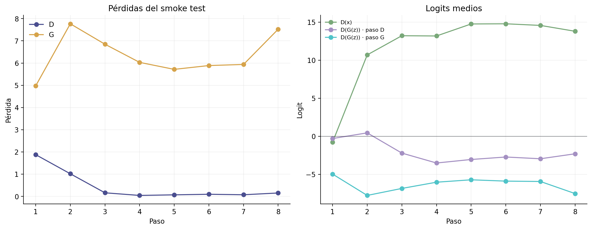
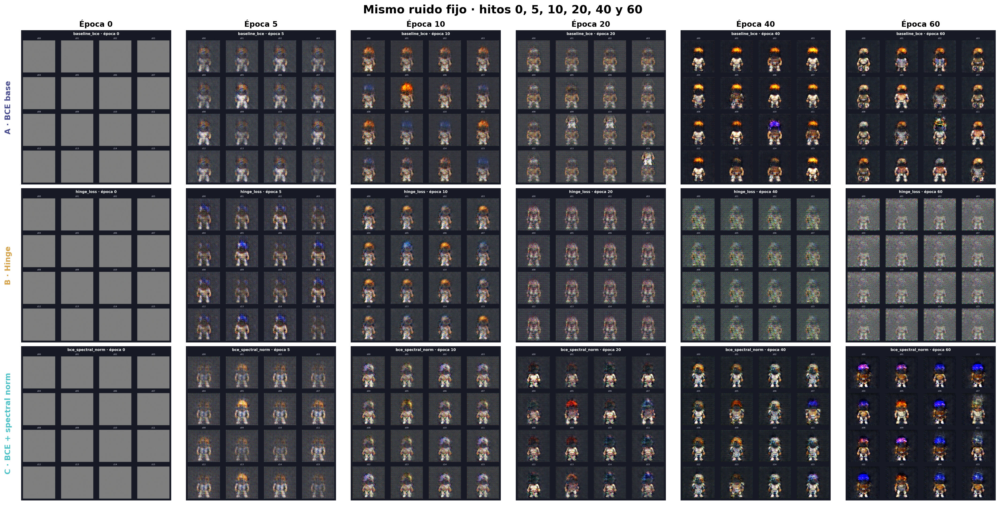
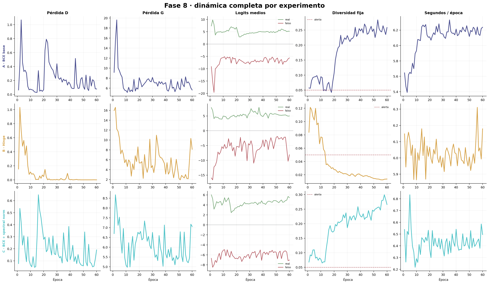

# Eryndor: Guardianes del Velo

Proyecto 2 de Deep Learning 2026: diseño generativo de personajes para un RPG pixel art de aventura y magia mediante una GAN entrenada por el equipo.

> **Estado actual:** fase 9 implementada y auditada en preparación. Los tres experimentos alcanzaron 60/60 en sus métricas y `bce_spectral_norm` es la selección provisional. ResNet18 ya está en caché local, pero el `latest.pt` presente contiene internamente la época 1; debe restaurarse desde Drive el checkpoint C de época 60 antes de calcular vecinos reales.

## Resultado de esta fase

| Evidencia | Resultado real |
|---|---:|
| Imágenes RGB | 4,096 |
| Resolución | 64 × 64 |
| Hashes duplicados | 0 |
| Archivos faltantes | 0 |
| Tipos corporales | 2,060 male / 2,036 female |
| Estilos de cabello | 44 |
| Estilos de torso | 18 |
| Ocupación media | 23.18% |
| Capas LPC acreditadas | 254 / 254 |
| Lote validado | `[64, 3, 64, 64]`, `float32`, `[-1, 1]` |
| Parámetros G / D | 3,806,080 / 2,765,568 |
| Smoke test | 8 pasos, 64 imágenes, aprobado |
| Checkpoint recargado | Error máximo absoluto 0 |
| Entrenamiento A / B / C | 60 / 60 / 60 épocas |
| Auditoría de fase 8 | 180 épocas + 11,520 pasos válidos |
| Modelo provisional | C · BCE + spectral normalization |
| Pipeline de vecinos | Implementado: ResNet18 + coseno + MSE |
| Checkpoint C local | Archivo presente, época interna 1/60 |
| Pesos ResNet18 | Oficiales y disponibles en caché local |
| Pipeline de selección | Smoke test sintético aprobado |
| Galería final válida | Pendiente de vecinos y selección 10/200 |
| Presentación PDF | 12 páginas, validación automática aprobada |
| Presentación HTML | 12 escenas, teclado, vista general y validación en navegador |
| Entrenamiento Colab | Completado; artefactos sincronizados |

El conjunto usa una pose frontal consistente, fondo obsidiana y combinaciones de armadura, ropa, cabello, sombreros, tonos y armas acordes con el universo. La construcción usa semilla `2026`, deduplicación SHA-256 y manifiesto por imagen.


## Universo visual

Eryndor es un mundo de fantasía fracturado por magia mineral. Sus guardianes exploran ruinas, recuperan reliquias y contienen grietas arcanas. El lenguaje visual combina sprites detallados, siluetas completas, materiales gastados y acentos de cian, oro y amatista.

La dirección creativa completa está en [`BRIEF.md`](BRIEF.md) y el sistema visual en [`docs/THEME.md`](docs/THEME.md).

## Datos y licencias

Las composiciones derivan de recursos abiertos del proyecto Liberated Pixel Cup:

- [Universal LPC Spritesheet Character Generator](https://github.com/LiberatedPixelCup/Universal-LPC-Spritesheet-Character-Generator)
- [LPC Style Guide](https://lpc.opengameart.org/static/LPC-Style-Guide/build/styleguide.html)
- [LPC Base Assets](https://opengameart.org/content/liberated-pixel-cup-lpc-base-assets-sprites-map-tiles)

Se usó el commit `4963a69795255fb15a934c47f478a8bdcf3668f5`. El pipeline vinculó las 254 capas empleadas con sus créditos; no quedó ninguna sin resolver. Consulte [`docs/LPC_ATTRIBUTION.md`](docs/LPC_ATTRIBUTION.md) y [`docs/LPC_CREDITS_USED.csv`](docs/LPC_CREDITS_USED.csv).

LPC mezcla licencias como CC0, CC-BY, CC-BY-SA, OGA-BY y GPL. Este proyecto conserva autores, licencias y URLs, y no presenta el material base como propietario.

## Reproducir la fase 2

Desde la raíz del repositorio:

```powershell
python -m venv .venv
.\.venv\Scripts\Activate.ps1
pip install -r requirements.txt
powershell -ExecutionPolicy Bypass -File scripts\fetch_lpc.ps1
python scripts\prepare_dataset.py --count 4096
jupyter lab notebooks\01_proyecto_gan.ipynb
```

En Linux o Google Colab, el equivalente multiplataforma es:

```bash
python scripts/fetch_lpc.py
```

Si el manifiesto ya existe, el script lo reutiliza. Para regenerar exactamente las composiciones con la misma semilla:

```powershell
python scripts\prepare_dataset.py --count 4096 --overwrite
```

Salidas principales:

- `data/processed/sprites/`: PNG preparados;
- `data/processed/manifest.csv`: metadatos, SHA-256 y capas fuente;
- `artifacts/dataset/`: hoja de contacto y distribuciones;
- `artifacts/metrics/dataset_summary.json`: resumen verificable;
- `artifacts/metrics/dataloader_smoke_test.json`: contrato tensorial;
- `docs/LPC_CREDITS_USED.csv`: atribución por capa.

## Experimentos pre-registrados

| ID | Pérdida | Estabilización | Variable modificada |
|---|---|---|---|
| A | BCE no saturante | Baseline | Ninguna |
| B | Hinge loss | Igual al baseline | Solo la pérdida |
| C | BCE no saturante | Normalización espectral en D | Solo la estabilización |

Los tres experimentos usarán los mismos datos, arquitectura, semilla, ruido fijo, optimizadores y 60 épocas. El diseño completo está en [`docs/PLAN_EXPERIMENTAL.md`](docs/PLAN_EXPERIMENTAL.md).

## Implementación y smoke test

La fase 3 incorporó:

- generador DCGAN de cinco convoluciones transpuestas;
- discriminador de cinco convoluciones con salida en logits;
- BCE no saturante y hinge loss bajo una interfaz común;
- normalización espectral opcional solo en D;
- entrenamiento adversarial con métricas por paso;
- rejillas de ruido fijo y curvas exportadas con Matplotlib;
- checkpoints atómicos con modelos, optimizadores, ruido fijo, estados aleatorios y estado de barajado del `DataLoader`;
- validación de guardado/recarga con salida idéntica.

Para repetir el diagnóstico:

```powershell
python scripts\smoke_test_gan.py
```

El smoke test real utilizó CPU, batch 8 y ocho pasos. Todas las pérdidas fueron finitas y las tres variantes respetaron las formas esperadas. El baseline mostró dominio temprano de D (`loss_D: 1.879 → 0.153`; `loss_G: 4.970 → 7.522`), una señal que deberá monitorearse durante las primeras épocas. Es un control de integración, no una comparación de calidad.



## Entrenamiento controlado — puntos 6 a 8 del plan

Los tres experimentos completaron el protocolo pre-registrado: 4,096 imágenes, batch 64, 64 pasos por época, arquitectura idéntica, semilla de modelo `42` y el mismo ruido fijo con semilla `777`. Solo cambiaron la pérdida o la normalización espectral según el diseño A/B/C.

| Experimento | Épocas | loss D | loss G | Logit real | Logit falso para G | Diversidad fija |
|---|---:|---:|---:|---:|---:|---:|
| `baseline_bce` | 60 / 60 | 0.0789 | 5.6369 | 5.1900 | −5.6287 | 0.2585 |
| `hinge_loss` | 60 / 60 | 0.0000 | 8.1271 | 5.0046 | −8.1271 | 0.0136 |
| `bce_spectral_norm` | 60 / 60 | 0.1905 | 7.0557 | 5.4518 | −7.0458 | 0.2659 |

Las magnitudes BCE y hinge no se comparan directamente. La decisión usa la trayectoria completa, el mismo ruido fijo y revisión visual: el baseline conserva personajes reconocibles y diversidad final de 0.2585; hinge colapsa a una plantilla casi única, termina en 0.0136 y acumula 23 épocas con `loss_D < 1e-3`; la variante con normalización espectral mantiene la mayor diversidad final (0.2659) y media de las últimas diez épocas (0.2671), además de la mejor variedad cromática observada.

Por estas señales, **C · BCE + spectral normalization** queda seleccionado provisionalmente. La decisión debe confirmarse con vecinos ResNet18, MSE y el lote de 200 candidatos.





La auditoría reproducible se ejecuta con:

```powershell
python scripts\analyze_phase8.py
```

El ejecutor secuencial reanuda automáticamente cada experimento desde `checkpoints/<id>/latest.pt`:

```powershell
python scripts\train_all.py --epochs 60 --device auto
```

También se puede ejecutar cada variante por separado:

```powershell
python scripts\train_experiment.py --experiment baseline_bce --epochs 60
python scripts\train_experiment.py --experiment hinge_loss --epochs 60
python scripts\train_experiment.py --experiment bce_spectral_norm --epochs 60
python scripts\compare_experiments.py
```

El checkpoint completo se mantiene como archivo rodante para limitar el uso de disco; en las épocas 5, 10, 15, ..., 60 se conserva además una instantánea liviana del generador y su rejilla fija.

## Fase 9: vecinos más cercanos

[`scripts/analyze_phase9_neighbors.py`](scripts/analyze_phase9_neighbors.py) genera las 16 muestras del ruido fijo del checkpoint C y compara cada una contra las 4,096 imágenes de entrenamiento. Usa ResNet18 IMAGENET1K_V1 sin su capa final, embeddings normalizados y similitud coseno; el MSE en píxeles funciona como comprobación secundaria.

La fase queda separada de la selección final: no genera los 200 candidatos ni escribe en `galeria/`. Produce `fixed_noise_neighbors.csv`, una figura lado a lado y un resumen JSON en `artifacts/phase9/`. Una regla declarada (`coseno ≥ 0.95` y `MSE ≤ 0.01`) solo marca casos para revisión y no se interpreta automáticamente como prueba de memorización.

El control actual detectó correctamente:

- dataset completo: 4,096 imágenes, cero faltantes y cero hashes duplicados;
- pesos oficiales de ResNet18 disponibles;
- checkpoint C local desactualizado: época interna 1/60.

Después de restaurar desde Drive `checkpoints/bce_spectral_norm/latest.pt` de época 60:

```powershell
python scripts\check_phase9_readiness.py
python scripts\analyze_phase9_neighbors.py --device auto
```

El notebook de Colab también incluye estas celdas y respalda `artifacts/phase9/` en Drive.

## Galería y prueba de novedad — puntos 10 y 11 del plan

La implementación cumple el protocolo obligatorio sin presentar resultados prematuros:

- exige un checkpoint de al menos 60 épocas antes de escribir `galeria/`;
- genera exactamente 200 candidatos con semilla `20261011` y conserva sus vectores `z`;
- deriva filtros de ocupación y contraste desde las 4,096 imágenes reales;
- usa ResNet18 preentrenada para vecinos por similitud coseno y reporta MSE en píxeles;
- selecciona 10 candidatos mediante novedad, calidad técnica y diversidad greedy;
- declara `10/200 = 5%` en el manifiesto y en la procedencia;
- guarda nombres y roles coherentes con Eryndor como trabajo creativo adicional;
- regenera los diez PNG desde el checkpoint y exige diferencia RGB máxima igual a cero.

Auditoría actual:

```powershell
python scripts\check_phase5_readiness.py
python scripts\smoke_test_evaluation.py
```

Después de aprobar la fase 9, las fases 10–11 ejecutarán:

```powershell
python scripts\build_gallery.py --experiment bce_spectral_norm
python scripts\validate_gallery.py
```

Los pesos oficiales de ResNet18 ya están en la caché de este equipo. En un runtime nuevo de Colab se descargarán una vez; el programa nunca los sustituye silenciosamente por una red aleatoria.

> **Resultado actual honesto:** el smoke test usa datos sintéticos únicamente para validar filtrado, vecinos y selección. No crea imágenes en `galeria/` y no constituye evidencia de calidad de la GAN.

## Presentación regenerable — punto 14 del plan

[`presentation/presentacion.html`](presentation/presentacion.html) es la versión interactiva para exponer: navegación por teclado, pantalla completa, vista general, diseño responsivo y actualización desde artefactos reales. [`presentation/presentacion.pdf`](presentation/presentacion.pdf) funciona como informe entregable y respeta el máximo de 12 diapositivas. Ambas incorporan la matriz exigida y cubren universo, datos, arquitectura, hipótesis A/B/C, ruido fijo, curvas, fallos, galería, vecinos, conclusiones y reflexión.

La presentación no contiene métricas escritas a mano: [`scripts/build_presentation.py`](scripts/build_presentation.py) lee los artefactos vigentes, genera `presentation/generated_results.tex`, compila con XeLaTeX y comprueba el número de páginas, el formato 16:9 y la presencia de texto. El entrenamiento y la fase 8 ya están reflejados; las diapositivas de galería y vecinos mantienen explícitamente **evidencia pendiente** hasta completar las fases 9–11.

La versión web se actualiza y valida con:

```powershell
python scripts\build_html_presentation.py
start presentation\presentacion.html
```

Para regenerarla:

```powershell
python scripts\build_presentation.py
```

Los resultados de validación quedan en `artifacts/presentation/build_status.json` y `html_status.json`. La tipografía GNU FreeSans se incluye con su licencia para que la apariencia sea reproducible.

## Fase 7 completada: entrenamiento reanudable en Colab

[`notebooks/02_entrenamiento_colab.ipynb`](notebooks/02_entrenamiento_colab.ipynb) guía la ejecución GPU sin cambiar el protocolo A/B/C. Reconstruye el dataset en el disco rápido del runtime, restaura avances desde Drive y usa `--backup-root` para reflejar checkpoints, métricas y ruido fijo al terminar cada época.

Cambios de seguridad para sesiones interrumpibles:

- `latest.pt` se sobrescribe atómicamente al finalizar **cada época**;
- las instantáneas históricas del generador y del ruido fijo permanecen cada cinco épocas;
- una nueva sesión puede restaurar automáticamente el estado respaldado;
- el notebook exige CUDA y verifica que no existan épocas duplicadas después de reanudar;
- el descargador `scripts/fetch_lpc.py` funciona en Linux, Windows y Colab.

La fase 7 ya terminó: los artefactos de métricas y muestras de A/B/C quedaron sincronizados. GitHub no versiona los checkpoints pesados; los `latest.pt` locales siguen en época 1 y el respaldo final de C debe restaurarse desde Drive para continuar.

## Trabajo pendiente antes de la entrega

1. Restaurar desde Drive el checkpoint `bce_spectral_norm/latest.pt` cuya época interna sea 60 y ejecutar la fase 9.
2. Ejecutar las fases 10–11: generar 200 candidatos, seleccionar 10 y guardar sus vectores `z` y manifiesto.
3. Cerrar los puntos 12–14: README, notebook y presentación con la galería validada.
4. Ejecutar la matriz de evidencias y validación integral del punto 15 antes de comprimir la entrega.

## Estructura

```text
.
├── artifacts/               # Figuras y métricas, incluidas phase8/ y phase9/
├── checkpoints/             # Pesos y estados de optimizador
├── configs/experiments.yaml
├── data/raw/                # Clon LPC selectivo, no versionado
├── data/processed/          # Dataset generado, no versionado
├── docs/                    # Plan, tema y atribuciones
├── galeria/                 # Diez salidas finales de la GAN
├── notebooks/01_proyecto_gan.ipynb
├── notebooks/02_entrenamiento_colab.ipynb
├── presentation/            # Fuente LaTeX, tipografía y PDF de 12 diapositivas
├── scripts/fetch_lpc.ps1
├── scripts/fetch_lpc.py
├── scripts/prepare_dataset.py
├── scripts/smoke_test_gan.py
├── scripts/train_experiment.py
├── scripts/train_all.py
├── scripts/compare_experiments.py
├── scripts/analyze_phase8.py
├── scripts/check_phase9_readiness.py
├── scripts/analyze_phase9_neighbors.py
├── scripts/check_phase5_readiness.py
├── scripts/smoke_test_evaluation.py
├── scripts/build_gallery.py
├── scripts/build_presentation.py
├── scripts/build_html_presentation.py
├── scripts/build_colab_notebook.py
├── scripts/validate_gallery.py
├── src/data.py
├── src/evaluation.py
├── src/losses.py
├── src/models.py
├── src/training.py
├── BRIEF.md
└── requirements.txt
```

## Transparencia sobre IA

Se utilizó un asistente de IA para estructurar el repositorio, proponer y revisar código, apoyar la dirección creativa y documentar la metodología. Los integrantes deben verificar las ejecuciones, interpretar los resultados y defender las decisiones. Ninguna imagen de un generador externo se incorporó al dataset ni podrá presentarse como salida final de la GAN.

La auditoría siguió procedimientos estructurados de análisis reproducible descritos por Kassis et al. (2026), *Scientific Agent Skills: A Library of Procedural Knowledge for Research Agents*, [arXiv:2609.00065](https://arxiv.org/abs/2609.00065).
